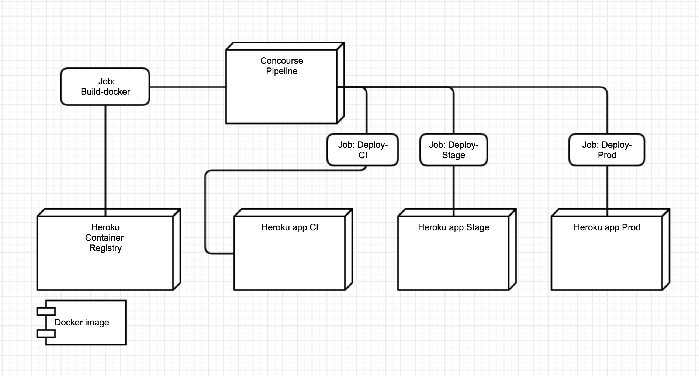

# Eksamensoppgave   (NB. NB. Ikke å anse som utlevert før beskjed blir gitt, og tidligst mandag 11. November)

## Fra Læreplan

"Egenutviklet applikasjon (eller prototype) med tilhørende dokumentasjon: teller 100% av karakteren i emnet. Applikasjonen skal være utviklet, og være vedlikeholdbar, i et DevOps- miljø i skyen. Kildekode, og annen dokumentasjon, skal gjøres tilgjengelig for allmenheten."

Siden et kontinuerlig kjørende DevOps-miljø kan være kostnadsbærende for studentene vil vi lette på kravet om miljøet skal kjøre kontinuerlig i skyen. Applikasjonen må istedet være mulig å etablere i skyen ved hjelp av infrastruktur som kode (Terraform) - og enkel automatisering.

På den måten kan de som måtte ønske å ta løsningen i bruk ( for eksempel eksaminator ) bruke egen infrastruktur (og da ta kostnaden for drift av miljøet)

## Krav

Applikasjonen og tilhørende DevOps infrastruktur skal gjøres tilgjenglig i  GitHib repositories.

Det skal lages minst to repositories,

* Ett til infrastruktur (concourse + terraform)
* Ett for en eksempel-applikasjon.
* N antall for andre applikasjoner eller komponenter

Studentene skal sende lenke til disse repositoriene til eksaminator. Dette er den eneste innleveringen som skal gjøres.

Følgende to repositories kan brukes som startpunkt, og tilsvarer øvingen vi gjorde i forelesning om monitorering, minus status-cake.

- https://github.com/PGR301-2018/exam-infra
- https://github.com/PGR301-2018/exam-app

## Applikasjon

Applikasjonen må være innholdsrik nok demonstrere DevOps-prinisipper og bevise ferdigheter hos studenten.

* Applikasjonen skal bestå av både av et API og en database. Minimalt et REST API med CRUD kapabilitet.   
* Databasen kan være "in Memory" (h2 osv)- Dvs. Dere trenger ikke tenke på å sette opp database-infrastruktur.
* Applikasjonen skal bygge med Maven
* Applikasjonen skal ha enhetstester
* Dersom noen av testene feiler, skal bygget også feile

Applikasjonen skal være skrevet på en slik måte at drift og vedlikehold er enkelt og i henhold til prinsipper i [the twelve factor app]](https://12factor.net/)

De viktigste prinsippene og overholde er ;

* III Config. Ignen hemmeligheter eller konfigurasjon i applikasjonen (ingen config filer med passord/brukere/URLer osv) - se på application.yml i eksempel-applikasjonene vi har laget i timene.

Pass spesielt godt på å ikke sjekke inn API nøkler, Github Personal access token, Deploy keys osv.

* XI Logs. Applikasjonen skal bruke et rammeverk for logging, og logge til Stdout (System.out i Java)

Bruk Logback, Log4j eller tilsvarende, ikke System.out.println();

* X Dev/Prod parity - Applikasjonen bør kunne kjøre i identisk infrastruktur i alle miljløer (utviklking, stage, prod, og lokal utviklingsmaskin)

## Krav til Infrastruktur

* Det skal opprettes tre identiske miljøer

- CI (Contuinous integraiton) - Master branch i applikasjon-repository skal til enhver tid installeres i dette miljøet.   
- Stage - Dette er et miljø som typisk brukes for tester, for eksmpel ytelses- eller sikkerhetstester.
- Prod - Dette er miljøet som kundene- eller brukerene av løsningen opplever.

* Nødvendig infrastruktur skal så langt det lar seg gjøre opprettes med Terraform. Det skal ikke være nødvendig å for eksaminator å ha terraform installert på PC for å etablere infrastrukturen - terraformkoden skal kjøres av CI/CD verktøy (concourse).

For Infrastruktur som ikke kan opprettes med Terraform, kan dere lage instruksjoner i README.md i <infra-repository>    

## Krav til DevOps Pipeline

Det skal lages en CI/CDpipeline for applikasjonen.

* Pipeline skal implementeres med Concourse
* Det skal være en concourse jobb som heter "infra" som oppretter nødvemndig infrastruktur ved hjelp av terraform-kode.
* Pipeline skal kontinuerlig deploye hver commit på master branch i applikasjons-repository til CI-miljøet

* Strategi for Deployment fra CI-miljø videre til Stage og produksjon er valgfritt. Dere kan velge 1) continous deployment, hvor hver commit automatisk flyter igjennom alle miljøene. Eller, dere kan implementere en strategi der man manuelt promoterer et bygg, slik vi har gjort med Heroku pipelines.

## Evauluering

Karakter settes ved at studenten utvider pipeline gitt i utlevering med minst en ekstra modul. Studentene velger selv hvilke moduler de vil levere, og implementasjon av en modul gir poeng.

* 15 poeng (E)
* 20 poeng (D)
* 30 poeng (C)
* 40 poeng (B)
* 50 poeng (A)

* Hvis en oppgave er løst, men ikke 100% korrekt kan det fortsatt gis poeng. Bruk README filen til å forklare hva som var hansikt å mål, dersom man ikke får til en oppgave.

## Krav til leveranse - og hva eksaminator gjør  

Du har to alternativer for innlevering.

* Du koder "offentlig" og lager public Github repositories. Jeg vil lage forks av disse.
* Du koder "privat" og inviterer github bruker *glennbech* som collaborator med lesetilgang. Jeg lager så  forks av disse.

Det stilles følgende krav til leveransen

* Du skal levere ved å sende epost til post@glennbech.no, hust å skrive fult navn
* Du skal også i eposten skrive hvilken oppgave du har valgt å løse. Det gjølr evalueringen raskere.
* Infra-repository skal inneholde en credentials_example.yml som eksemplifiserer nødvendige hemmeligheter som er nødvendig for pipeline (github_tokens, deploy keys, api keys til diverse tjenester osv).
* Lenke til repositories

Eksaminator ...

* Lager forks av de inleverte repositories. Lager deploy keys
* Endrer pipeline, og setter inn nye repositories under source (egne forks)  
* Døper om filen credentials_example.yml til credentials.yml og legger inn sine egne hemmeligheter
* Endrer variables.tf eller andre filer basert på instrukser i README filen.
* Sletter eventuelle .terraform katalog og terraform.tfstate fil
* KJører ```fly -t (min target) set-pipeline <infra repo>/concourse/pipeline.yml -l <infra repo>/credentials.yml -p student_name``` i sitt eget Concourse-miljø.
* Kjører "infra" jobben i Concourse
* Kjører "app" jobben i Concourse
* Comitter kode på master branch for å teste pipeline

## Oppgaver

# Basis pipeline (10 poeng)

* Innleveringen skal tilfredstille krav nevnt over under "Krav til leveranse".

# Docker (20 poeng)

I vår basis-pipeline gjør Heroku et bygg av koden på hver commit til master. Heroku bygger en "slug" som er en binær leveransepakke som inneholder din applikasjon, og annen nødvendig programvare. Dette ivaretar prinsippet om ett bygg, av en artifakt som "flyter" mellom miljøer.

Heroku slugs er derimot ikke en standardisert måte å pakke applikasjoner på. Hvis man ønsker å bruke en annen sky-leverandør en Herku, må man endre måten man pakker og installerer applikasjoner på.

Docker, og containere støttes av de fleste public cloud leverandører og hvis man benytter containers, får man stor fleksibilitet og utvalg av platformer.

Denne oppgaven består av følgende;




* Du skal lage en Concourse pipeline, som bygger et Docker Image av Spring Boot eksemel-applikasjonen. Docker image skal lastes opp i et Container Registry. Heroku støtter dette, så man kan fullføre denne oppgaven med Heroku.
* En concourse jobb skal sørge for at hver commit til master branch i applikasjonen skal resultere i en ny Docker image versjon
* En  concourse jobb skal sørge for at siste versjon av Docker image installeres i CI miljøet.
* En concourse jobb skal sørge for at docker images som vellykket har blitt installert i CI miljøet installeres i stage miljøet
* En concourse jobb skal kjøre minst en test mot appliksjonen i stage miljøet. Et forslag her er å ha en egen Spring profil som kjører Integrasjonstester med REST-assured.  
* En concourse jobb skal installere docker images som vellykket har passert Stage, i produksjonsmiljøet


# Overvåkning, varsling og Metrics (20 poeng)

Denne oppgaven består av å implementere overvåkning, og varsling i applikasjonen.

Krav til oppgaven;

Metrics skal implementeres ved hjelp av følgende Heroku Addon https://elements.heroku.com/addons/hostedgraphite

Heroku-Addon "hosted graphite" - skal legges til applikasjon ved hjelp av terraform

Terraform kode for å legge til en Add-on vil se slik ut
```
# Create a hosted graphite, and configure the app to use it
resource "heroku_addon" "hostedgraphite" {
  app  = "${heroku_app.production.name}"
  plan = "hostedgraphite"
}
```

- Applikasjonen skal logge egendefinerte metrics. Med det menes at man på valgte steder i applikasjonskoden skal logge datapunkter.

Til dette skal applikasjonen bruke [Metrics bibliotektet fra Dropwizard](https://metrics.dropwizard.io/4.0.0/getting-started.html
) å integrere dette i Spring boot applikasjonen ;

```xml
<dependency>
      <groupId>io.dropwizard.metrics</groupId>
      <artifactId>metrics-core</artifactId>
      <version>4.0.3</version>
  </dependency>

  <dependency>
      <groupId>io.dropwizard.metrics</groupId>
      <artifactId>metrics-graphite</artifactId>
      <version>4.0.3</version>
  </dependency>
```

DropWizard Metrics skal konfigureres til å levere datapunkter til HostedGraphite i Heroku - Dere kan legge til en slik klasse, eller noe tilsvarende inn i Spring Boot Applikasjonen for å få til det.

```java
@Configuration
public class GraphiteMetricsConfig {

    @Bean
    public MetricRegistry getRegistry() {
        return new MetricRegistry();
    }

    @Bean
    public GraphiteReporter getReporter(MetricRegistry registry) {
        Graphite graphite = new Graphite(new InetSocketAddress(System.getenv("GRAPHITE_HOST"), 2003));
        GraphiteReporter reporter = GraphiteReporter.forRegistry(registry)
                .prefixedWith(System.getenv("HOSTEDGRAPHITE_APIKEY"))
                .convertRatesTo(TimeUnit.SECONDS)
                .convertDurationsTo(TimeUnit.MILLISECONDS)
                .filter(MetricFilter.ALL)
                .build(graphite);
        reporter.start(1, TimeUnit.SECONDS);
        return reporter;
    }
}
```

Med DropWizard man man for eksempel bruke en "Meter" klasse for å telle antall forekomster av en hendelse;

```java
@RequestMapping("/")
public String welcome() {
    registry.meter("welcome").mark();
    return "....";
}
```

I evalueringen vektlegges det at man utvider Applikasjonen nok til å demonstrere  forskjellige typer metrics. Minst tre av disse;

- meter
- gauge
- counter
- histogram
- timer

- Applikasjonen sine endepunkter skal også overvåkes slik at problemer oppdages raskt. Vi har gjort øvinger der StatusCake til dette. Her kan dere gjenbruke terraform kode fra tidligere øving.

- Vi vektlegger 12 Factor app prinsippet "Environment" parity i denne oppgaven. Alle miljøene skal ha egne addons for metrics. Ikke bare for eksempel production. Lokalt miljø skal også produsere metrics - men dette kan dele infrastruktur med CI miljø.

*OBS*

Denne oppgaven har et "høne/egg" problem som ofte kan oppstå når teori møter virkelighet.

Man må kjøre terraform for å få opprettet pipeline, heroku applikasjoner og add-ons.

Før terraform har kjørt, vet man ikke hva GRAPHITE_HOST vil bli. Samtidig trenger man å sette denne verdien inn i GRAPHITE_HOST miljø-variablen i  Terraform koden til applikasjonen.

I slike tilfeller må man være pragmatisk, og bruke en tom Verdi for GRAPHITE_HOST i terraform for applikasjonen første gang man kjører terraform.

Så man man gå inn i UI for HostedGraphite add-on, finne verdien for GRAPHITE_HOST, sette den- før man kjører det hele på nytt.

Denne type "Temporaler" avhengigheter er ikke uvanlig, og viser bare at det fortsatt er utfordringer igjen å løse i "infrastruktur som kode" domenet.


# Applikasjonslogger (10 poeng)

Denne oppgaven består av å bruke en tjeneste for innsamling, visualisering og analyse av logger. Dere ska utvide applikasjonen på en slik måte at logger sendes til denne tjenesten.

I oppgaven skla sdere registrere dere på- og bruke tjenesten [Logz.io](https://app.logz.io/) som er en SAAS løsning som tilbyr ELK (ElasticSearch, Logstash, Kibana) Stack der man kan lagre 3GB med lagring i en "community" plan som er gratis.

På nettsidene til logz.io er det [instruksjoner dere kan følge for å sette opp logging i Java  applikasjoner](https://app.logz.io/#/dashboard/data-sources/Java--logbackappender). (Det lønner deg å være logget på hvis dere følger lenken.)

OBS. Dere må ikke bruke Logz.io som en Heroku-addon. Det koster penger.

For å få en bedre forståelse for ELK stacken, ligger det en docker-compose.yml fil i <infra-repo>/elk. Stå i den katalogen og kjør kommandoen ```docker-compose up -d```

Etter dere har gjort der får dere startet lokalt

- ElasticSearch (http://localhost:9200)
- Kibana (http://localhost:5601)

Referansedokumentasjon ; https://elk-docker.readthedocs.io/#updating-logstash-configuration

Eksaminator vil se ut ifra konfigurasjon, og ut ifra applikasjonskode at en slik tjeneste er tatt i bruk.


# Serverless (10 Poeng)

* Det skal leveres en Google Cloud Function, eller AWS Lambda function.
* Bygging, og deployment av Serverless-komponenten skal gjøres på samme måte som annen kode ved hjelp av concourse.

# Nyttige lenker

* https://developer.github.com/v3/guides/managing-deploy-keys/#deploy-keys
* https://devcenter.heroku.com/articles/platform-api-quickstart
