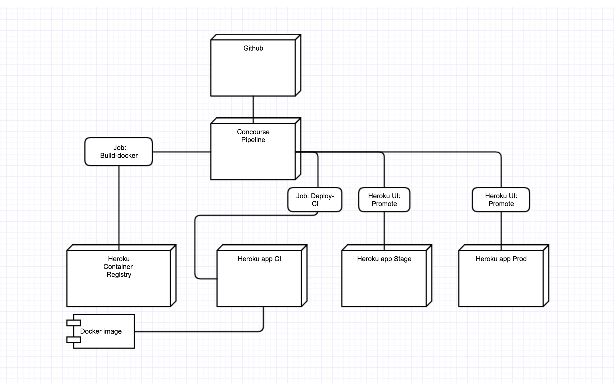

# Eksamensoppgave PGR301

## Fra Læreplan

"Egenutviklet applikasjon (eller prototype) med tilhørende dokumentasjon: teller 100% av karakteren i emnet. Applikasjonen skal være utviklet, og være vedlikeholdbar, i et DevOps- miljø i skyen. Kildekode, og annen dokumentasjon, skal gjøres tilgjengelig for allmenheten."

Siden et kontinuerlig kjørende DevOps-miljø kan være kostnadsbærende for studentene vil vi lette på kravet om miljøet skal kjøre kontinuerlig i skyen. Applikasjonen må istedet være mulig å etablere i skyen ved hjelp av infrastruktur som kode (Terraform) - og enkel automatisering.

På den måten kan de som måtte ønske å ta løsningen i bruk ( for eksempel eksaminator ) bruke egen infrastruktur (og da ta kostnaden for drift av miljøet)

## Krav

Applikasjonen og tilhørende DevOps infrastruktur skal gjøres tilgjenglig i  GitHib repositories.

Det skal lages minst to repositories,

* Ett til infrastruktur (concourse + terraform)
* Ett for en eksempel-applikasjon.
* N antall for andre applikasjoner eller komponenter

Studentene skal sende lenke til disse repositoriene til eksaminator. Dette er den eneste innleveringen som skal gjøres.

Følgende to repositories kan brukes som startpunkt, og tilsvarer øvingen vi gjorde i forelesning om monitorering.

- https://github.com/PGR301-2018/exam-infra
- https://github.com/PGR301-2018/exam-app

For å komme i gang ... (Dette kan dere fra Øvingene!!)

* Pass på at concourse kjører- Gå til localhost:8080
* Lag en fork av repositories
* Endre <infra>/terraform/variables.tf - velg deg unike verdier for prefix, og pipeline navn
* Lag deploy keys for repositoryene, installer disse, og ta vare på privat key.
* Modifieser Credentials.yml og legg inn dine hemmeligheter (blant annet deploy keys)
* Kjør (Der target er det du vanligvis bruker)  
* Du er nå klar for å begynne på eksamen.        

```
fly -t ≤target> sp -p pipeline_name -c concourse/pipeline.yml -l credentials.yaml
```

* Gå til concourse, og trykk på "Infra" jobben. Sjekk at du har fått opprettet Heroku Pipeline og statuscake dashboards.

* Gå til concourse, og velg "Deploy app" jobben. Spring Boot applikasjonen skal nå være deployet på Heroku.

## Applikasjon

Applikasjonen må være innholdsrik nok demonstrere DevOps-prinisipper og bevise ferdigheter hos studenten.

* Applikasjonen skal bestå av både av et API og en database. Minimalt et REST API med CRUD kapabilitet.   
* Databasen kan være "in Memory" (h2 osv)- Dvs. Dere trenger ikke tenke på å sette opp database-infrastruktur.
* Applikasjonen skal bygge med Maven
* Applikasjonen skal ha enhetstester
* Dersom noen av testene feiler, skal bygget også feile

Applikasjonen skal være skrevet på en slik måte at drift og vedlikehold er enkelt og i henhold til prinsipper i [the twelve factor app](https://12factor.net/)

De viktigste prinsippene og overholde er ;

* III Config. Ignen hemmeligheter eller konfigurasjon i applikasjonen (ingen config filer med passord/brukere/URLer osv) - se på application.yml i eksempel-applikasjonene vi har laget i timene.

Pass godt på å ikke sjekke inn API nøkler, Github Personal access token, Deploy keys osv.

* XI Logs. Applikasjonen skal bruke et rammeverk for logging, og logge til Stdout (System.out i Java)

Bruk Logback eller Log4j via sl4j i Spring Boot. Ikke bruk System.out.println();

* X Dev/Prod parity - Applikasjonen bør kunne kjøre i identisk infrastruktur i alle miljløer (utviklking, stage, prod, og lokal utviklingsmaskin). Etterstreb å jobbe loaklt, ved å kjøre heroku local.

* Bonuspoeng til de som klarer å få Concourse til a Cache m2 repo. (https://stackoverflow.com/questions/40736296/how-to-cache-maven-repository-between-builds) - Det vil spare dere mye tid !

## Krav til Infrastruktur

* Det skal opprettes tre identiske miljøer

- CI (Contuinous integraiton) - Master branch i applikasjon-repository skal til enhver tid installeres i dette miljøet.   
- Stage - Dette er et miljø som typisk brukes for tester, for eksmpel ytelses- eller sikkerhetstester.
- Prod - Dette er miljøet som kundene- eller brukerene av løsningen opplever.

Nødvendig infrastruktur skal så langt det lar seg gjøre opprettes med Terraform. Det skal ikke være nødvendig å for eksaminator å ha terraform installert på PC for å etablere infrastrukturen - terraformkoden skal kjøres av CI/CD verktøy (concourse).

For Infrastruktur som ikke kan opprettes med Terraform, kan dere lage instruksjoner i README.md i <infra-repository>    

## Krav til DevOps Pipeline

Det skal lages en CI/CDpipeline for applikasjonen.

* Pipeline skal implementeres med Concourse
* Det skal være en concourse jobb som heter "infra" som oppretter nødvemndig infrastruktur ved hjelp av terraform-kode.
* Pipeline skal kontinuerlig deploye hver commit på master branch i applikasjons-repository til CI-miljøet

* Deployment fra CI-miljø videre til Stage og produksjon skal i utgangspunktet skje manuelt ved at man promoterer applikasjonen i Heroku UI () slik vi har gjort det i øvingene). Studentene kan fritt velge å implementre kontinuerlig deployment til stage, og fra stage til prod - men det gis ikke poeng for dette.

## Evaluering

Karakter settes ved at studenten utvider pipeline gitt i utlevering med minst en ekstra modul. Studentene velger selv hvilke moduler de vil levere, og implementasjon av en modul gir poeng som teller mot karakter på oppgaven.

* 15 poeng (E)
* 20 poeng (D)
* 30 poeng (C)
* 40 poeng (B)
* 50 poeng (A)

* Hvis en oppgave er løst, men ikke 100% korrekt kan det fortsatt gis poeng. Bruk README filen til å forklare hva som var hansikt å mål, dersom man ikke får til en oppgave.

## Krav til leveranse - og hva eksaminator gjør  


Det stilles følgende krav til leveransen

* Du må lage en annonym Github bruker - brukernavnet må være utformet slik at det ikke går ann å utlede hvem du er basert på navnet. 
* Repositories som du lagert må være offentlige
* Det må ikke være mulig ut ifra koden å identifsere studenten. Det er viktig å ikke benytte @author tags osv.
* Du skal levere lenke til relevante repositories i wiseflow
* I infra-repository sin README skal det går klart frem hvilke oppgaver du har valgt å løse. Andre instruksjoner skal også ligge der. 
* Infra-repository skal inneholde en credentials_example.yml som eksemplifiserer nødvendige hemmeligheter som er nødvendig for pipeline (github_tokens, deploy keys, api keys til diverse tjenester osv).
* Lenke til repositories

Eksaminator gjør følgende når han får oppgaven ...

* Lager forks av de inleverte repositories. Lager deploy keys
* Endrer pipeline.yml, og setter inn sine repositories under "source"   
* Døper om filen credentials_example.yml til credentials.yml og legger inn sine egne hemmeligheter
* Endrer variables.tf eller andre filer basert på instrukser i README filen.
* Sletter eventuelle .terraform katalog og terraform.tfstate fil
* KJører ```fly -t (min target) set-pipeline -c <infra repo>/concourse/pipeline.yml -l <infra repo>/credentials.yml -p student_name``` i sitt eget Concourse-miljø.
* Kjører "infra" jobben i Concourse
* Comitter kode på master branch, og venter på at bygget skal starte av seg selv.
* Leser README :-)

## Oppgaver

# Basis pipeline (10 poeng)

* Innleveringen skal tilfredstille krav nevnt over under "Krav til leveranse". Korrekt levering gir automatisk 10 poeng. Det anbefales på det sterkeste å gå igjennom Concourse tutorial dersom studenten ikke har jort det tidligere i kurset; https://concoursetutorial.com/

# Docker (20 poeng)

I vår basis-pipeline gjør Heroku et bygg av koden på hver commit til master.

Heroku bygger en "slug" som er en binær leveransepakke som inneholder din applikasjon, og annen nødvendig programvare. Dette ivaretar prinsippet om ett bygg, av en artifakt som "flyter" mellom miljøer.

Heroku slugs er derimot _ikke_ en standardisert måte å pakke applikasjoner på. Hvis man ønsker å bruke en annen sky-leverandør enn Heroku, står man på bar bakke.

Docker, og containere støttes av de fleste public cloud leverandører, og hvis man benytter containers får man stor fleksibilitet og utvalg av platformer.

I denne oppgaven skal dere bygge et nytt Docker image for hver commit til _app-repo_ master branch, og laste det opp i heroku [container registry](https://blogs.vmware.com/cloudnative/2017/06/21/what-is-a-container-registry/).



CI miljøet skal så oppdateres med siste versjon av koden, dersom alle tester har gått bra. Det gir  veldig god separasjon mellom bygg og deploy/release som er et viktig [12 factor app prinsipp](https://12factor.net/build-release-run)

Det anbefales at studenten gjør seg kjent med hvordan Docker fungerer sammen med Heroku. [Denne veiledningen er et godt utgangspunkt](https://devcenter.heroku.com/articles/container-registry-and-runtime) - bruk litt tid på den!! Løsningen på oppgaven er å kjøre Heroku på kommandolinje fra Concourse.

Praktiske oppgaver;

* Du skal skrive en Dockerfil som kan brukes for å bygge et Container Image av Spring Boot applikasjonen din.
* Du skal  utvide Concourse pipeline, til å bygge et Docker image fra Docker filen
* Docker image skal lastes opp til Heroku Docker Registry
* Hvis bygget går okey, og det dukker opp en nytt container image i registry- skal dette deployes til CI miljøet ved hjelp av en egen Concourse jobb.

Pipeline skal se slik ut når dere er ferdige.


For å laste opp/ned Docker image ved hjelp av concourse kan man bruke en spesiell ressurstype

```yaml
resource:
- name: docker-image-app
  type: docker-image
  source:
    repository: registry.heroku.com/((heroku_app_name))/web
    username: ((heroku_email))
    password: ((heroku_api_key))
```

Man kan så fra pipeline gjøre en "put" mot denne ressursen

```
jobs:
 - name: build
   plan:
   (bla blah blah)
    - put: docker-image-app
      params:
        build: jar-file
```

Dokumentasjon om denne mekanismen finnes her; https://concoursetutorial.com/miscellaneous/docker-images/ - bruk litt tid på å sette dere inn i dette.

For bare å deploye Docker images som har "passert" bygge-fasen uten feil, bruker vi "passed:" i concourse jobben slik ;

```
  name: deploy-ci
  plan:
    - aggregate:
      - get: monitoring-infra
      - get: docker-image-app
        trigger: true
        passed: [build]
```

(Det er det som gjør at jobbene kommer "etter hverandre" i dashbordet)

(Parameter "jar-file", er en output fra en Task. Output inneholder en Dockerfile og nødvendige filer, som applikasjon-jar filen.)

Hint:

Dere må bruke heroku CLI og ```heroku container:release web``i en concourse jobb for å deploye versjonen som nylig ble publisert til Heroku Container registry. Dette er ikke støttet i Docker imaget som brukes for Heroku i det utleverte materialet. (Som har gammel versjon av CLI)

Dere må derfor bruke et annet Docker image som basis for tasken som skal kjøre heroku CLI fra Concourse. Eksempel på Deploy-Task er gitt her;
```
platform: linux

image_resource:
  type: docker-image
  source:
    repository: wingrunr21/alpine-heroku-cli
    tag: "latest"

params:
    heroku_email:
    heroku_api_token:
    app_name:

run:
  path: sh
  dir: .
  args:
    - -exc
    - |
      cat > /root/.netrc <<EOF
      machine api.heroku.com
          login ${heroku_email}
          password ${heroku_api_token}
      machine git.heroku.com
          login ${heroku_email}
          password ${heroku_api_token}
      EOF
      export HEROKU_API_KEY=${heroku_api_token}
      heroku container:release web -a ${app_name}

```

# Overvåkning, varsling og Metrics (20 poeng)

Denne oppgaven består av å implementere overvåkning, og varsling i applikasjonen.

Krav til oppgaven;

Metrics skal implementeres ved hjelp av følgende Heroku Addon https://elements.heroku.com/addons/hostedgraphite

Heroku-Addon "hosted graphite" - skal legges til applikasjon ved hjelp av terraform

Terraform kode for å legge til en Add-on  for ett miljø vil se slik ut
```
# Create a hosted graphite, and configure the app to use it
resource "heroku_addon" "hostedgraphite" {
  app  = "${heroku_app.production.name}"
  plan = "hostedgraphite"
}
```

- Applikasjonen skal logge egendefinerte metrics. Med det menes at man på valgte steder i applikasjonskoden skal logge datapunkter.

Til dette skal applikasjonen bruke [Metrics bibliotektet fra Dropwizard](https://metrics.dropwizard.io/4.0.0/getting-started.html
) å integrere dette i Spring boot applikasjonen ;

```xml
<dependency>
      <groupId>io.dropwizard.metrics</groupId>
      <artifactId>metrics-core</artifactId>
      <version>4.0.3</version>
  </dependency>

  <dependency>
      <groupId>io.dropwizard.metrics</groupId>
      <artifactId>metrics-graphite</artifactId>
      <version>4.0.3</version>
  </dependency>
```

DropWizard Metrics skal konfigureres til å levere datapunkter til HostedGraphite add-on'en til Heroku - Dere kan legge til en slik klasse, eller noe tilsvarende inn i Spring Boot Applikasjonen for å få til det. se https://metrics.dropwizard.io/4.0.0/manual/graphite.html#manual-graphite

```java
@Configuration
public class GraphiteMetricsConfig {

    @Bean
    public MetricRegistry getRegistry() {
        return new MetricRegistry();
    }

    @Bean
    public GraphiteReporter getReporter(MetricRegistry registry) {
        Graphite graphite = new Graphite(new InetSocketAddress(System.getenv("GRAPHITE_HOST"), 2003));
        GraphiteReporter reporter = GraphiteReporter.forRegistry(registry)
                .prefixedWith(System.getenv("HOSTEDGRAPHITE_APIKEY"))
                .convertRatesTo(TimeUnit.SECONDS)
                .convertDurationsTo(TimeUnit.MILLISECONDS)
                .filter(MetricFilter.ALL)
                .build(graphite);
        reporter.start(1, TimeUnit.SECONDS);
        return reporter;
    }
}
```

Med DropWizard man man for eksempel bruke en "Meter" klasse for å telle antall forekomster av en hendelse;

```java
@RequestMapping("/")
public String welcome() {
    registry.meter("welcome").mark();
    return "....";
}
```

I evalueringen vektlegges det at man utvider Applikasjonen nok til å demonstrere  forskjellige typer metrics. Minst tre av disse;

* meter, gauge, counter, histogram, timer

- Applikasjonen sine endepunkter skal også overvåkes slik at problemer oppdages raskt. Vi har gjort øvinger der StatusCake til dette. Her kan dere gjenbruke terraform kode fra tidligere øving.

- Vi vektlegger 12 Factor app prinsippet "Environment" parity i denne oppgaven. Alle miljøene skal ha egne addons for metrics. Ikke bare for eksempel production. Lokalt miljø skal også produsere metrics - men dette kan dele infrastruktur med CI miljø.

*OBS*

Denne oppgaven har et "høne/egg" problem som ofte kan oppstå når teori møter virkelighet.

Man må kjøre terraform for å få opprettet pipeline, heroku applikasjoner og add-ons.

Før terraform har kjørt, vet man ikke hva GRAPHITE_HOST, og HOSTEDGRAPHITE_APIKEY vil bli. Samtidig trenger man å sette disse verdien inn i miljø-variabler i Heroku via Terraform.

I slike tilfeller må man være pragmatisk, og bruke en tomme Verdier for ukjente parametere første gang man kjører terraform.

Så man man gå inn i UI for HostedGraphite add-on, finne verdien for GRAPHITE_HOST, og HOSTEDGRAPHITE_APIKEY for deretter å sette den- før man kjører det hele på nytt.

Denne type "temporale" avhengigheter er ikke uvanlig, og viser bare at det fortsatt er utfordringer igjen å løse i "infrastruktur som kode" domenet.


# Applikasjonslogger (10 poeng)

Denne oppgaven består av å bruke en tjeneste for innsamling, visualisering og analyse av logger. Dere ska utvide applikasjonen på en slik måte at logger sendes til denne tjenesten.

I oppgaven skla sdere registrere dere på- og bruke tjenesten [Logz.io](https://app.logz.io/) som er en SAAS løsning som tilbyr ELK (ElasticSearch, Logstash, Kibana) Stack der man kan lagre 3GB med lagring i en plan som er gratis.

På nettsidene til logz.io er det [instruksjoner dere kan følge for å sette opp logging i Java  applikasjoner](https://app.logz.io/#/dashboard/data-sources/Java--logbackappender). (Det lønner deg å være logget på hvis dere følger lenken.)

OBS. Dere må ikke bruke Logz.io som en Heroku-addon. Det koster penger.

For å få en bedre forståelse for ELK stacken, ligger det en docker-compose.yml fil i <infra-repo>/elk. Stå i den katalogen og kjør kommandoen ```docker-compose up -d```

Etter dere har gjort der får dere startet lokalt

- ElasticSearch (http://localhost:9200)
- Kibana (http://localhost:5601)

Referansedokumentasjon ; https://elk-docker.readthedocs.io/

Eksaminator vil se ut ifra konfigurasjon(logback.xml), og ut ifra applikasjonskode (Log statements) at en slik tjeneste er tatt i bruk.

# Serverless (10 Poeng)

* Det skal leveres en Google Cloud Function, eller AWS Lambda funksjon.
* Bygging, og deployment av Serverless-komponenten skal gjøres på samme måte som annen kode ved hjelp av concourse.
* Husk å legge til eksempel på nøkler i credentials_example.yaml!

# Kjente problemer

- Infra jobben i concourse "feiler" dersom den kjører uten at noen endringer i infrastrukturen utføres. Bonuspoeng til den eller de som løser dette!
- Dockerfile i example-app ; vær obs på ARG JAR_FILE. Prosessen som bygger Docker image (concourse put, til resource docker-image) funker ikke så bra . ENTRYPOINT må trolig også byttes ut om CMD


LYKKE TIL !!
